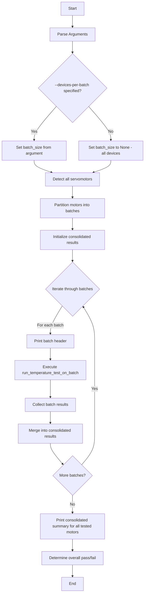

# High-Level Plan: Enhance `test_get_temperature.py` for Batched Testing

The primary goal is to modify the script to test devices in batches, as specified by a new command-line argument. This prevents drawing excessive current when many devices are tested simultaneously.

**1. Introduce New Command-Line Arguments:**
*   Add `--devices-per-batch` (integer): This will specify the maximum number of devices to test concurrently in a single batch.
*   If `--devices-per-batch` is not provided, the script will default to testing all detected devices in a single batch, preserving the original behavior.

**2. Implement Batched Test Execution:**
*   The script will first detect all available servomotors.
*   It will then partition the list of detected motors into smaller lists ("batches") based on the `--devices-per-batch` value.
*   The script will iterate through these batches, executing the full temperature test for one batch at a time.

**3. Refactor the Core Test Logic:**
*   To enable batching, the main test logic will be encapsulated within a dedicated function (e.g., `run_temperature_test_on_batch`).
*   This function will accept a list of motor objects as input.
*   It will perform the complete temperature test routine on only the motors in the provided list:
    *   Take initial temperature readings.
    *   Run motors at high power for the specified duration.
    *   Take final temperature readings.
    *   Validate the results and store them.

**4. Consolidate Final Reporting:**
*   Results from each batch (pass/fail status, temperature changes) will be collected.
*   After all batches have been tested, the script will print a single, comprehensive summary report that includes the results for every motor, grouped by batch.

## Proposed Workflow

```mermaid
graph TD
    A[Start] --> B(Parse Arguments);
    B --> C{--devices-per-batch specified?};
    C -- Yes --> D[Set batch_size from argument];
    C -- No --> E[Set batch_size to all devices];
    D --> F[Detect all servomotors];
    E --> F;
    F --> G[Group detected motors into batches];
    G --> H{Iterate through batches};
    H -- For each batch --> I[Execute temperature test on the current batch];
    I --> J[Collect results];
    J --> K{More batches?};
    K -- Yes --> H;
    K -- No --> M[Print consolidated summary for all tested motors];
    M --> N[End];

## Detailed Implementation Plan

### Current State Analysis

The existing `test_get_temperature.py` is a comprehensive temperature testing script that:
- Tests all detected motors simultaneously
- Uses the `servomotor` library with `M3` class
- Implements robust device detection with retries
- Monitors motor status during high-power operation
- Provides detailed results analysis and reporting

### Implementation Strategy

Based on the requirements above, the implementation will add batched testing to prevent excessive current draw when testing many devices simultaneously while maintaining all existing functionality.

### 1. New Command-Line Arguments

**Add to `main()` function:**
```python
parser.add_argument('--devices-per-batch', type=int,
                  help='Maximum number of devices to test concurrently in a single batch (default: test all devices)')
```

### 2. Core Architecture Changes

**Refactor the main test logic into a dedicated function:**
- Extract current `test_get_temperature()` logic into `run_temperature_test_on_batch()`
- Create new `test_get_temperature()` function that orchestrates batching
- Maintain all existing functionality within each batch

### 3. Batching Implementation

**Device Partitioning Logic:**
```python
def partition_devices_into_batches(devices, devices_per_batch):
   """Partition detected devices into batches for testing"""
   if devices_per_batch is None:
       return [devices]  # Single batch with all devices
   
   batches = []
   for i in range(0, len(devices), devices_per_batch):
       batch = devices[i:i + devices_per_batch]
       batches.append(batch)
   return batches
```

### 4. Enhanced Results Management

**Batch Results Consolidation:**
- Collect results from each batch execution
- Maintain individual motor results across all batches
- Provide comprehensive summary reporting grouped by batch

### 5. Updated Workflow



### 6. Detailed Implementation Steps

#### Step 1: Add Command-Line Argument
- Add `--devices-per-batch` argument to `argparse` configuration
- Update help text and validation

#### Step 2: Create Batching Function
- Implement `partition_devices_into_batches()` function
- Handle edge cases (empty device list, batch size larger than device count)

#### Step 3: Refactor Core Test Logic
- Rename current `test_get_temperature()` to `run_temperature_test_on_batch()`
- Ensure function accepts device list and returns results dictionary
- Maintain all existing functionality unchanged

#### Step 4: Create New Orchestration Function
- New `test_get_temperature()` function that:
 - Partitions devices into batches
 - Iterates through batches
 - Calls `run_temperature_test_on_batch()` for each batch
 - Consolidates results

#### Step 5: Enhanced Reporting
- Update `analyze_results()` to handle batch information
- Add batch grouping in summary output
- Maintain existing pass/fail criteria

#### Step 6: Update Documentation
- Update `test_get_temperature.md` with new batching feature
- Add usage examples for batched testing

### 7. Backward Compatibility

**Preserve Existing Behavior:**
- When `--devices-per-batch` is not specified, test all devices in single batch
- All existing command-line arguments remain unchanged
- Output format remains consistent for single-batch operation

### 8. Testing Strategy

**Validation Scenarios:**
1. **Single Device**: Verify batching works with one device
2. **Multiple Devices, No Batching**: Ensure backward compatibility
3. **Multiple Devices, Small Batches**: Test with `--devices-per-batch 2`
4. **Edge Cases**: Empty device list, batch size larger than device count

### 9. Expected Output Format

**Batched Test Output:**
```
========== BATCH 1 of 3 (2 devices) ==========
[Existing test output for batch 1]

========== BATCH 2 of 3 (2 devices) ==========
[Existing test output for batch 2]

========== BATCH 3 of 3 (1 device) ==========
[Existing test output for batch 3]

========== CONSOLIDATED TEMPERATURE TEST SUMMARY ==========
[Combined results from all batches]
```

### 10. Implementation Benefits

**Power Management:**
- Prevents excessive current draw from testing many motors simultaneously
- Allows testing of larger motor arrays safely
- Maintains thermal safety through controlled batch sizes

**Scalability:**
- Supports testing of any number of detected devices
- Configurable batch sizes for different hardware setups
- Maintains existing single-device and small-scale testing workflows

**Reliability:**
- Reduces risk of power supply overload
- Maintains existing robust error handling per batch
- Preserves all existing safety features

### 11. Code Changes Summary

**Files to be Modified:**
1. `test_get_temperature.py` - Main implementation
2. `test_get_temperature.md` - Documentation update

**Key Functions to be Added/Modified:**
- `partition_devices_into_batches()` - New function
- `run_temperature_test_on_batch()` - Renamed from `test_get_temperature()`
- `test_get_temperature()` - New orchestration function
- `analyze_results()` - Enhanced for batch reporting
- `main()` - Add new command-line argument

This plan maintains the existing robust functionality while adding the critical batching capability to handle larger numbers of servomotors safely and efficiently.